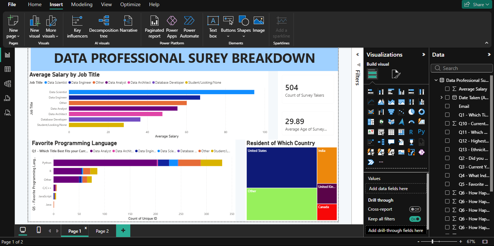
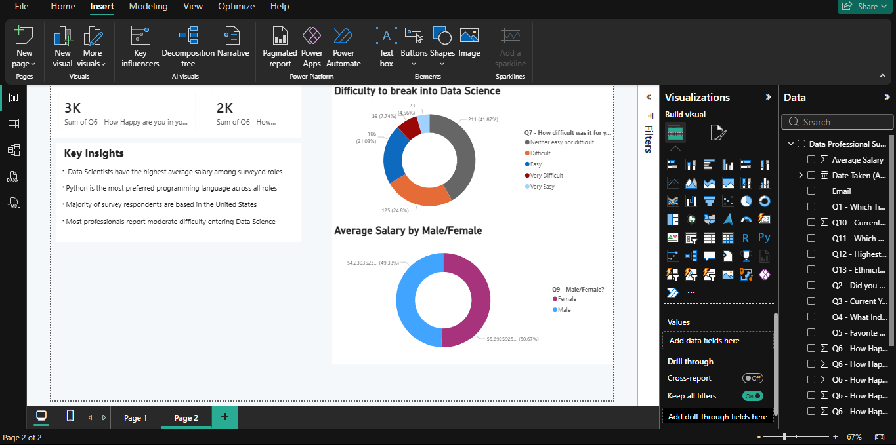

# powerbi-data-professional-survey
Power BI dashboard analyzing data from a professional survey.
## Power BI Data Professional Survey Dashboard
## Dashboard Preview

### Overview

### Key Insights

### Project Overview
This project explores a survey of data professionals to understand job roles, salary trends, preferred programming languages, and work satisfaction.

### Data Cleaning & Preparation
- Cleaned raw survey data using Power Query
- Split columns containing multiple responses
- Replaced inconsistent values and handled missing data
- Removed unnecessary columns and reordered fields for clarity
- Filtered data to improve analysis quality

### Dashboard Overview
- Average salary comparison across different job roles
- Programming language preferences of data professionals
- Country-wise distribution of survey respondents
- Work-life balance and salary satisfaction insights
- Summary section highlighting key findings

### Tools Used
- Power BI
- Power Query
- Excel

### Key Insights
- Data Scientists report higher average salaries compared to other roles
- Python is the most commonly used programming language
- A large portion of respondents is based in the United States
- Many professionals report moderate difficulty entering the data field

### Files
- `first project.pbix` – Power BI dashboard file
